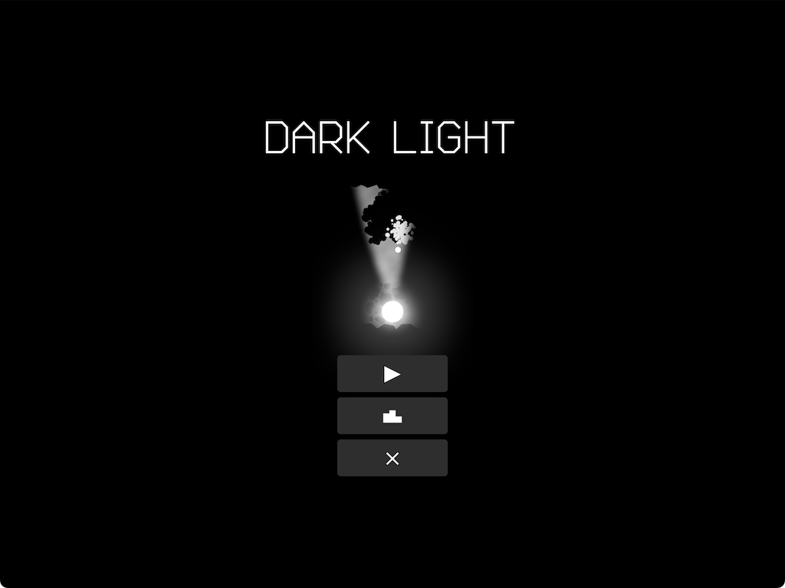

# Dark Light

v1.0

"Dark Light" is a Shoot Them All game with randomly generated levels and horror elements.

The player controls a white sphere in the labyrinth, where a dangerous black organism lurks in the shadows. The exit to the next level will open only when every cell of this organism has been destroyed.

HINT: 'W' or '↑' - up, 'A' or '→'' - right, 'S' '↓' - down, 'D' '←' - left, 'LMB' - first weapon, 'RMB' - second weapon, 'ESC' - pause.

Made with Godot

Design/Art/Code: [Aliaksandr Veledzimovich](https://twitter.com/veledzimovich)

Music: [Mubert](https://mubert.com)

Engine: [Godot](https://godotengine.org/) [License](https://godotengine.org/license)

