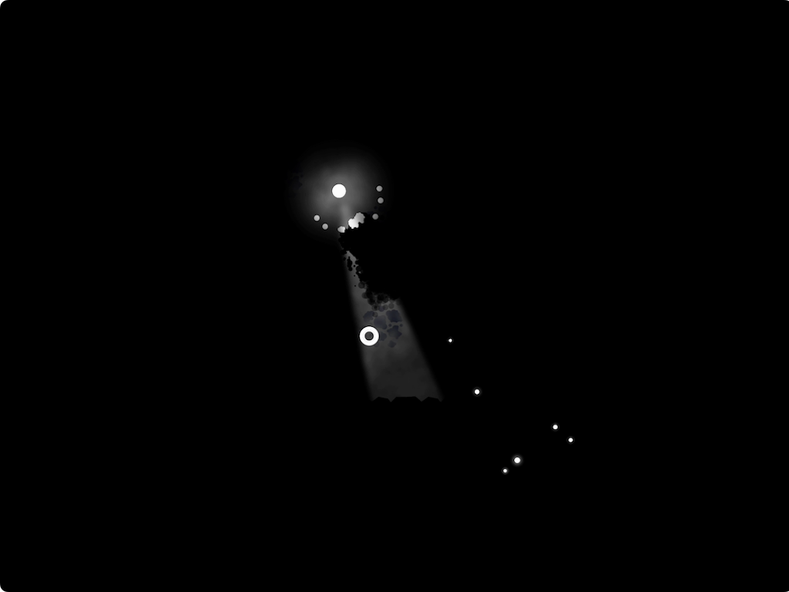

# Dark Light

## v1.0

Shoot Them All game with randomly generated levels and horror elements.

The player controls a white sphere in the labyrinth, where a dangerous black organism lurks in the shadows. The exit to the next level will open only when every cell of this organism has been destroyed.

### Controls

| Up | Left | Down | Right | Shoot | Strike | Pause |
|:--:|:----:|:----:|:-----:|:-----:|:------:|:-----:|
|  W |   A  |   S  |   D   |  LMB  |   RMB  |  ESC  |
|  ↑ |   ←  |   ↓  |   →   |       |        |       |

### Credits

Design/Art/Code: [Aliaksandr Veledzimovich](https://twitter.com/veledzimovich) 
Music: [Mubert](https://mubert.com) 
Engine: [Godot](https://godotengine.org/) [License](https://godotengine.org/license) 

